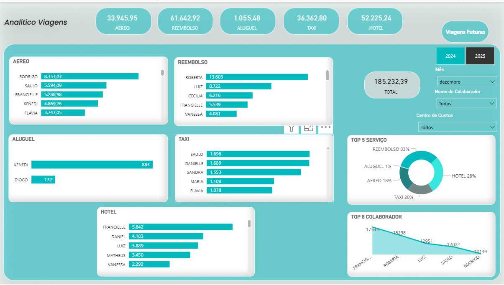
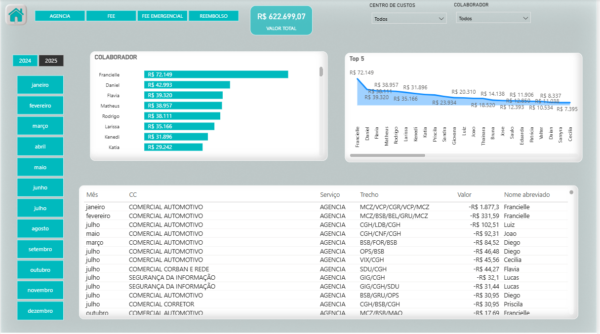
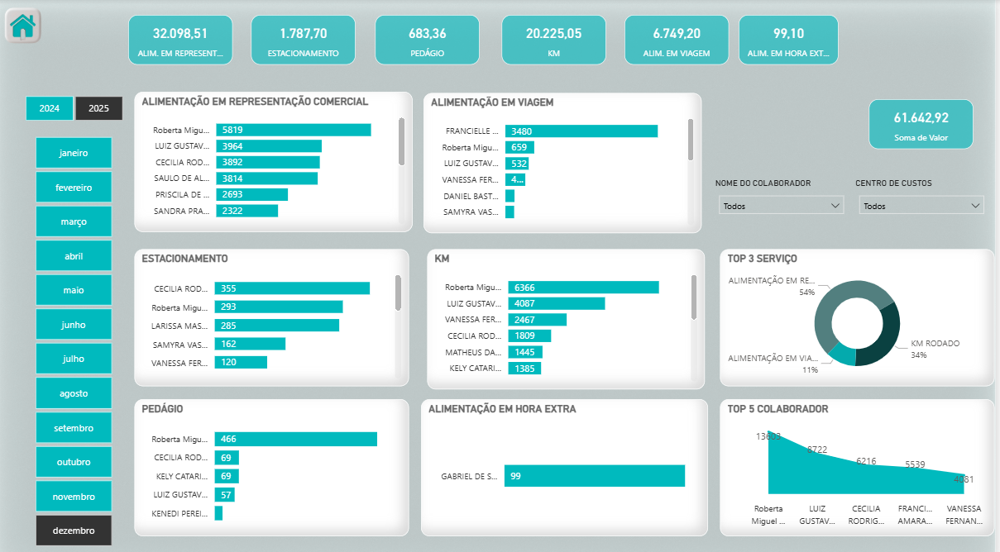
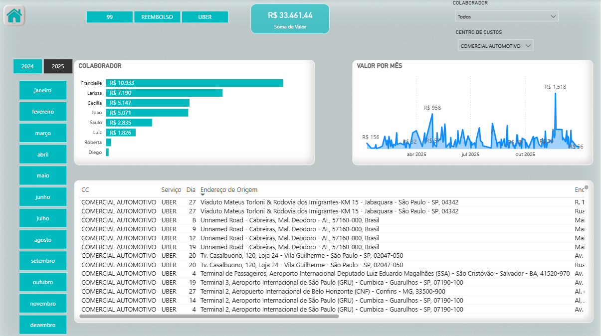
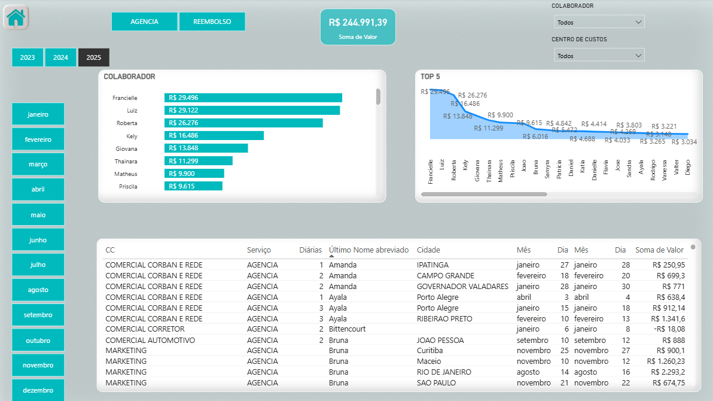
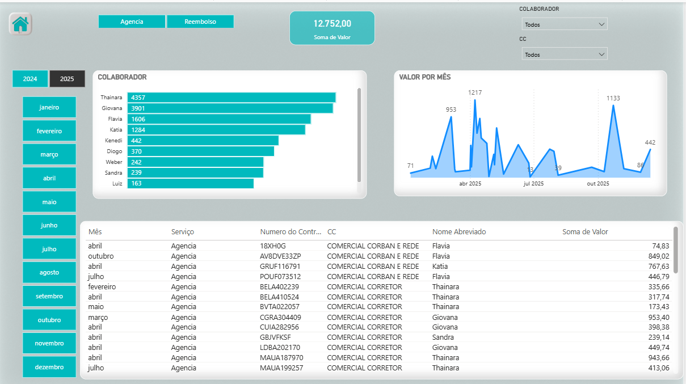

# Análise de Viagens Corporativas – Power BI

## 📌 Contexto
Projeto de Business Intelligence desenvolvido em Power BI com o objetivo
de analisar e controlar os gastos relacionados a viagens corporativas.
A solução oferece uma visão analítica e detalhada das despesas, apoiando
a tomada de decisão financeira e o controle de custos.

Os dados contemplam despesas com aéreo, hotel, reembolsos, transporte
individual e aluguel de veículos, segmentados por período, colaborador
e centro de custos.

---

## ❓ Perguntas de Negócio
- Qual o total gasto com viagens corporativas?
- Quais tipos de serviço concentram os maiores custos?
- Quais colaboradores possuem maior impacto financeiro?
- Como os gastos evoluem ao longo do tempo?
- Existem variações relevantes por centro de custos?

---

## 📊 KPIs Monitorados
- Total de gastos
- Gastos por tipo de serviço
- Gastos por colaborador
- Distribuição percentual por serviço
- Evolução mensal dos custos

---

## 🔄 Tratamento e Modelagem dos Dados
- Padronização de nomes via função no Power Query
- Ajuste de tipos de dados
- Organização para análise analítica
- Modelo orientado a análise temporal e financeira

---

## 🖼️ Dashboards

### 📍 Visão Geral

### ✈️ Aéreo

### 💰 Reembolso

### 🚕 Transporte Individual (Táxi / Uber / 99)

### 🏨 Hotel

### 🚗 Aluguel de Veículos

---

## 📎 Observação
Os dados e valores apresentados neste projeto são fictícios/simulados e foram utilizados exclusivamente para fins de portfólio, não representando informações reais de nenhuma empresa.
